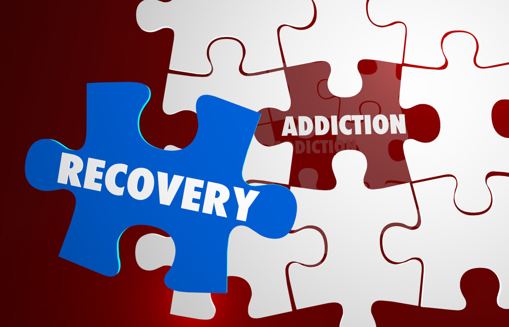

# Addiction-Solver
\
A Web Application to help people overcome their Addiction.
[Access Live page](https://addiction-solver.onrender.com/)

**The database is already setup and available in this branch so go ahead and run the app.**

How to run the app `flask --app app run --debug` 

How to setup the database `flask --app app init-db` \
How to run the seed.py `python3 seed.py`

# Important
I followed this [tutorial](https://flask.palletsprojects.com/en/3.0.x/tutorial/) that was recommended by **Mohammed**. The **results** are fruitful and encouraging. I know that the structure of code / syntax can be confusing, I also struggled understanding some concepts but with practice I'm understanding it. I urge to practice as well for a fruitful contribution.

#### Note - the main code is in the app folder.

# What's New
1. Now populating the help educational resource section with content from the database.
   
2. Check the eresource templates `app/templates/eresource/` and `app/routes/eresources.py`.
   
3. New tables added in db, that is `addiction` and `severity`.
   
4. New columns added to `educational_resource` table.
   
5. On this page `/help/eresources` the filters are generated from the database `addiction` table.
   
6. Form data is saved alongside with the logged in user id. Query the `addiction_data` table to see this. The code is in the `help.py` file.

## Next Step to fix
- [ ] The home page is not responsive on different screen sizes.
- [ ] peer-doctor chat is not implemented
  

### for this new upgrade.

